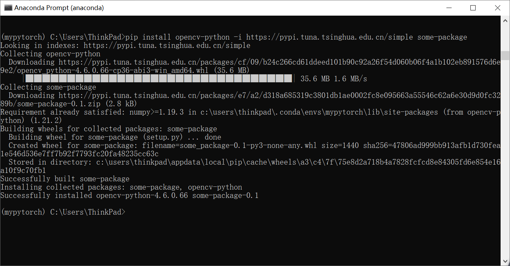

# 计算机视觉第三次作业

**岳东旭      2201212864**

## 1.opencv&Numpy&Matplotlib的安装

- 激活conda环境

  `conda activate mypytorch`

- 使用pip安装opencv

  `pip install opencv-python`

  
  
  **anaconda时自动安装好了Numpy和Matplotlib，这里不再重复演示。**

## 2.Numpy和CV2工具包的使用

[代码在这！]()

## 3.用OpenCV检测人脸

### 使用cv2.CascadeClassifier进行人脸检测

导入必要的包


```python
import numpy as np
import cv2
import matplotlib.pyplot as plt
```

### 读入图片,并回显


```python
img = cv2.imread('Lena.png')
cv2.imshow("im", img)
cv2.waitKey(0)
```


### 加载预训练模型参数

匹配人脸位置，返回矩形框参数


```python
detector = cv2.CascadeClassifier('haarcascade_frontalface_default.xml')
rect = detector.detectMultiScale(img, scaleFactor=1.1, minNeighbors=2, minSize=(10,10), flags=cv2.CASCADE_SCALE_IMAGE)
print(rect)
```

    [[219 203 169 169]]


根据矩形框参数在原图片上画出矩形，添加文字


```python
for (x,y,w,h) in rect:
    #根据坐标画矩形框  rectangle参数 pt1:矩形的顶点(x,y)  pt2:矩形的顶点pt1相反(x+w,y+h)。
    cv2.rectangle(img, (x,y), (x+w,y+h), (0,255,0), 2)
img_withtext = cv2.putText(img, "Lena", (10, 100), cv2.FONT_HERSHEY_SCRIPT_COMPLEX, 2.0, (100, 200, 200), 2)
```

### 显示处理后的图片


```python
cv2.imshow("im", img_withtext)
cv2.waitKey(0)
```

